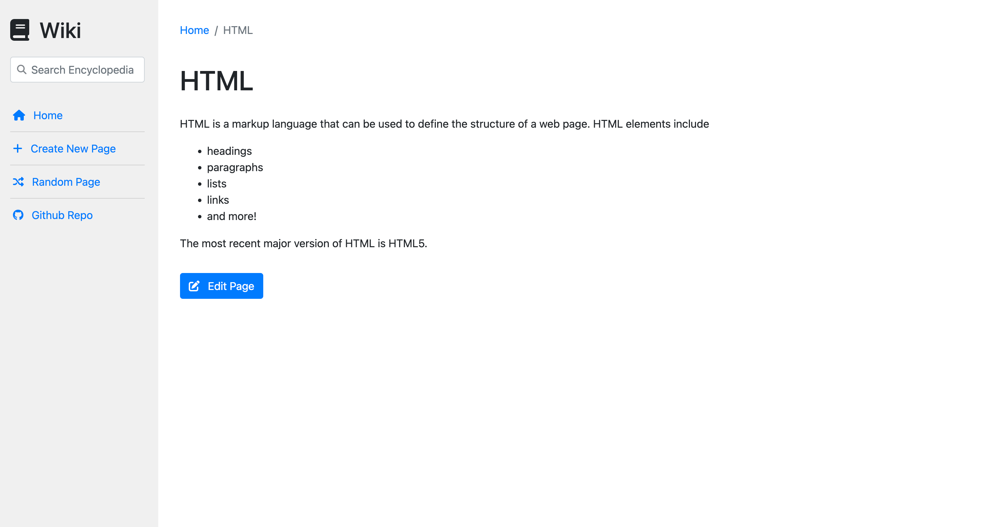
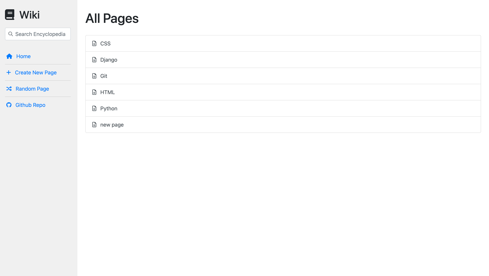
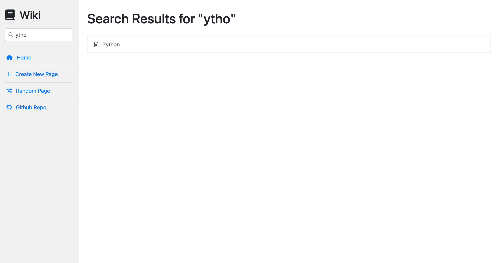
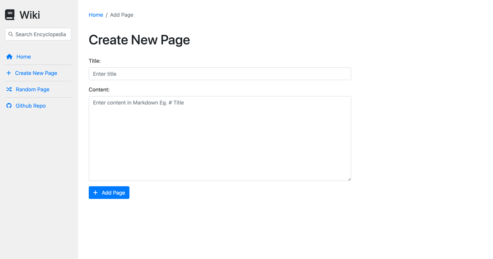
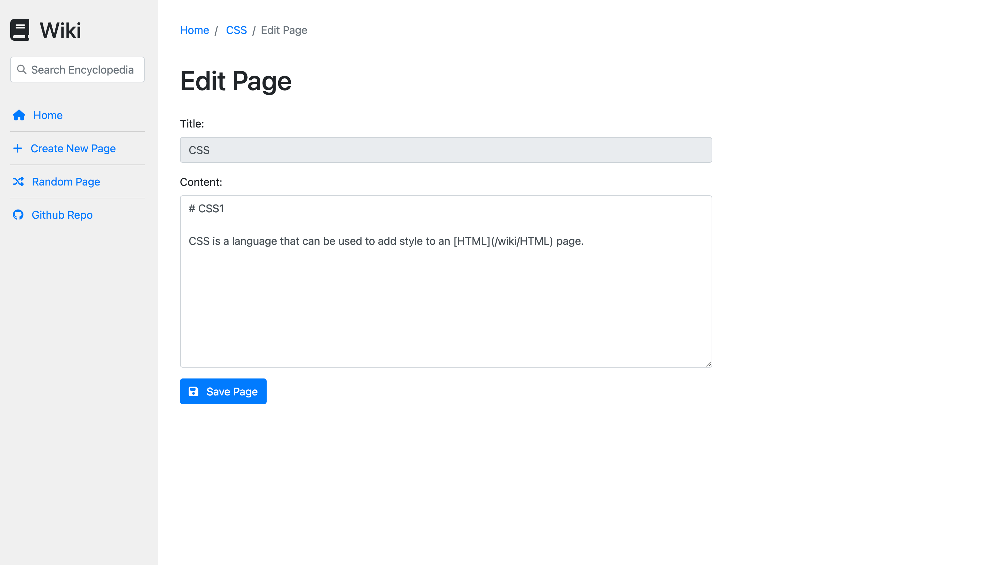

# CSCI-S-33a-project-1

## Project 1: Wiki

### Description

Design a Wikipedia-like online encyclopedia.

### Screenshots

#### Entry Page

#### Index Page

#### Search

#### New Page

#### Edit Page

### How to run

1. Clone the repository
2. Run `python manage.py runserver` in the terminal
3. Open the link in the browser

